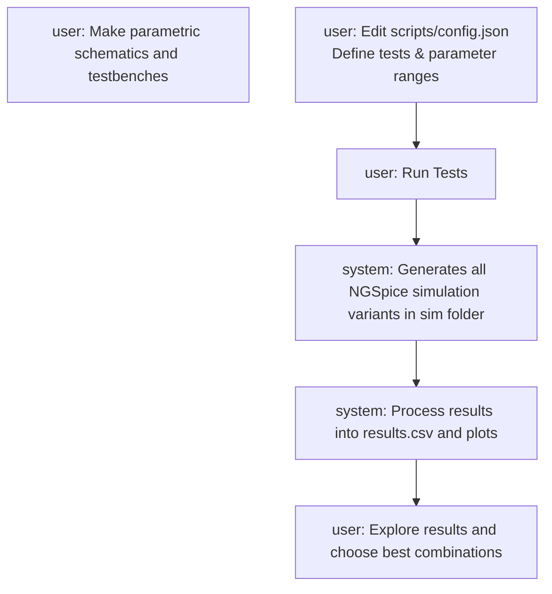

# sky130_ak_ip__sigma_delta

This project contains building blocks and implementations of sigma-delta modulators/analog-to-digital converters built using the SKY130A PDK and opensource tools. Many variations of parameters and topologies are studied at once and compared using automated test scripts.

## Requirements

The following software is required to view project files and run simulations:

- **xschem**: for schematics
- **ngspice**: for simulations
- **Python**: for automation scripts

## Workflow

This project automates NGSpice simulations using Python. Users define tests and parameter sweeps in `scripts/config.json`. For each test, the system runs a testbench schematic defined by the user, runs simulations, and processes results with a Python script. Output includes key circuit metrics such as power consumption, gain, and speed, depending on the circuit type.

## Key Features

- Automated testbench generation
- Parameter sweep support
- Python-based result processing
- Outputs key performance metrics
